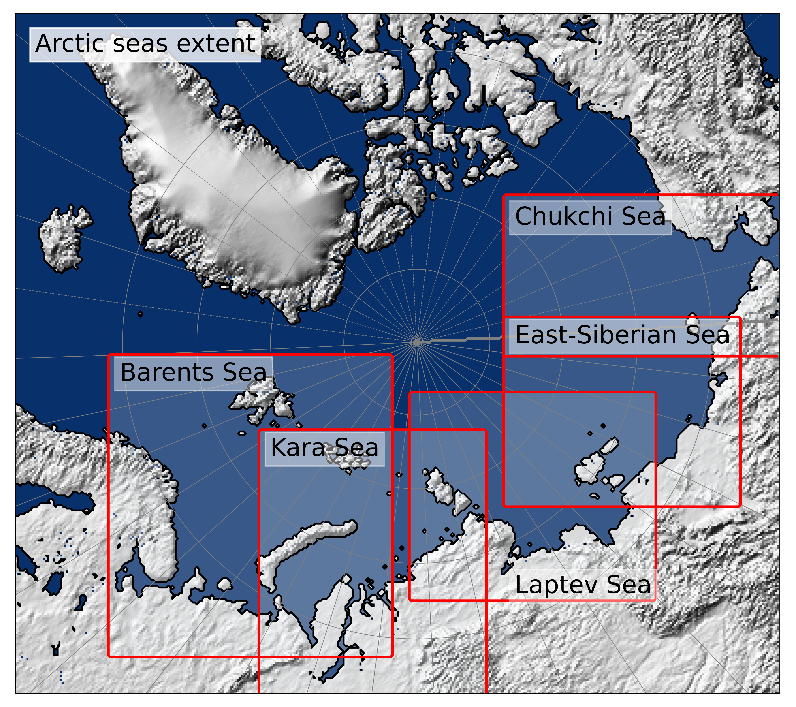
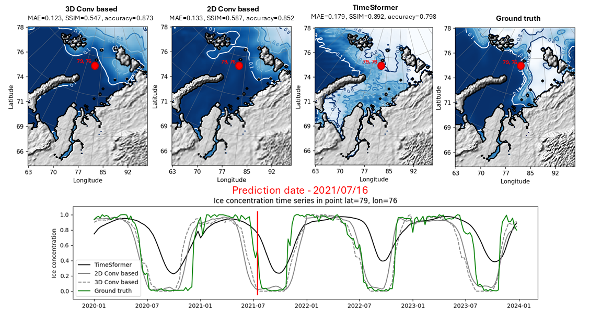
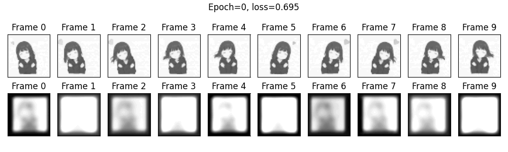
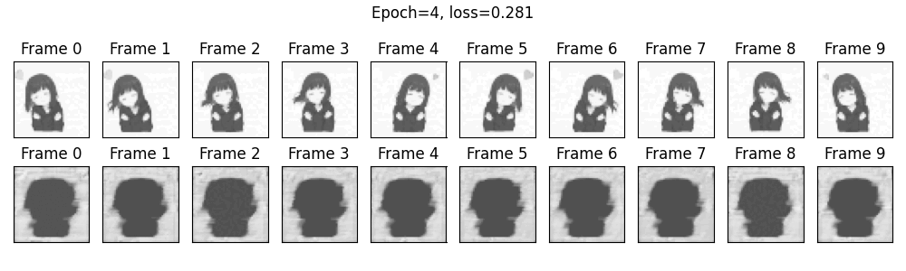

# Understanding the Limitations of Deep Transformer Models for Sea Ice Forecasting - ICCS 2025
# Towards the Limitations of Transformer Models for Metocean Forecasting - submitted to JOCS

## Content

This repo contains code and results of long-term sea ice concentration forecasting of four models: [2D CNN](cnn_forecaster_2d), [3D CNN](cnn_forecaster_3d), 
[TimeSformer](timesformer) and [SwinLSTM](swinlstm).

Code and results for toy example with loop video also presented for [all models](toy_example).

Supplementary materials as PDF can be loaded [as file](Supplementary%20materials.pdf).

## Sea ice concentration data

We used OSI SAF Global Sea Ice Concentration product as source data. The spatial resolution of the images is reduced to 14 km.
Five Arctic seas were selected as test areas, its spatial position presented on image:

## Sea ice - Results

Table with main results of 52 weeks ahead forecast with implemented models and its comparison with SOTA 
numerical (SEAS5) and deep learning (IceNet) solutions for sea ice prediction problem:

| Metric                | MAE SEAS5  | MAE 2D CNN | MAE 3D CNN  | MAE TimeS former | SSIM SEAS5 | SSIM 2D CNN  | SSIM 3D CNN  | SSIM TimeS former | Accuracy Ice Net | Accuracy 2D CNN  | Accuracy 3D CNN  | Accuracy TimeS former |
|-----------------------|-----------|----------------|---------|--------------|----------------|---------|---------|--------------|----------------------|---------|---------|--------------|
| **Kara Sea**          | 0.093     | **0.076**      | 0.076   | 0.109        | 0.653          | **0.683** | 0.663   | 0.581        | 0.918                | **0.945** | 0.943   | 0.929        |
| **Barents Sea**       | 0.073     | 0.063          | **0.060** | 0.129        | 0.634          | **0.684** | 0.672   | 0.489        | 0.906                | 0.922   | **0.944** | 0.916        |
| **Laptev Sea**        | 0.101     | **0.068**      | 0.072   | 0.146        | 0.703          | **0.722** | 0.706   | 0.608        | 0.967                | **0.982** | 0.980   | 0.966        |
| **East-Siberian Sea** | 0.098     | 0.074          | **0.069** | 0.177        | **0.723**      | 0.718   | 0.714   | 0.685        | 0.980                | **0.990** | 0.990   | 0.988        |
| **Chukchi Sea**       | **0.067** | 0.075          | 0.073   | 0.147        | **0.780**      | 0.713   | 0.719   | 0.588        | 0.974                | 0.979   | **0.981** | 0.962        |

Visualization of one timestep of prediction for Kara sea presented on image:

Convergence plots for models, extended tables with metrics by quarters and SwinLSTM prediction results are
presented in [file](Supplementary%20materials.pdf).

## Loop video prediction - Results

As a synthetic data gif-file with loop video was used. Images was set to gray scale and resized to 45x45 pixels. 

To understand convergence process of 2D CNN and TimeSformer and get reason of TimeSformer's quality lack inference 
for each epoch during optimization was produced.

2D CNN convergence process:

TimeSformer convergence process:

Convergence plots and metrics estimation are in [supplementary](Supplementary%20materials.pdf) and in the paper.

## Extended version

Atmosphere and ocean forecast cases are added to extend the validation to other subfields.
